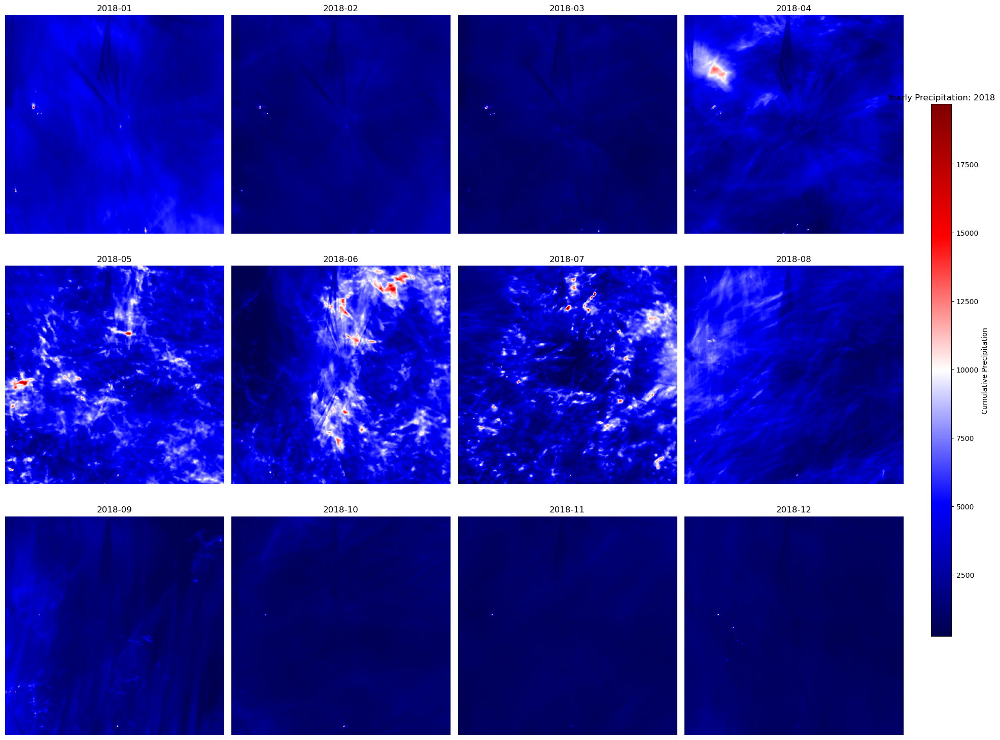

# Ilots de chaleur urbains et précipitations
To create the events dataset for 2018, run ``python src/make_dataset.py --year 2018``.

  Cumul des précipitations mensuelles sur 2018

  
  

  Données pluviométriques brutes (01/01/2018) &nbsp;&nbsp;&nbsp; Données après clustering (K-means, K=3)

